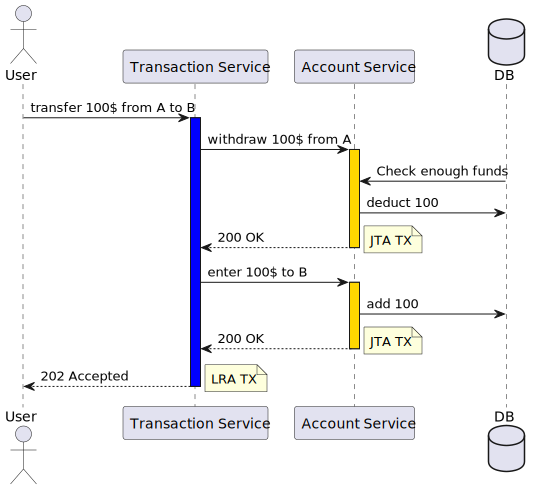

# Mini Bank
Simple example of MicroProfile LRA in Helidon.



## Build and Run

```bash
mvn clean package
docker-compose build
docker-compose up
```

## Test

```bash
curl -H "balance: 500" -X PUT localhost:8083/account/create/AB447
curl -H "balance: 500" -X PUT localhost:8083/account/create/AB448

# Transfers money from A to B
curl -v -X PUT --json '{"from":"AB448", "to":"AB447", "amount":"100"}' localhost:8084/transaction/transfer

# Transfers money to non-existent account, LRA TX is cancelled and money refunded to A   
curl -v -X PUT --json '{"from":"AB448", "to":"AB404", "amount":"100"}' localhost:8084/transaction/transfer
```